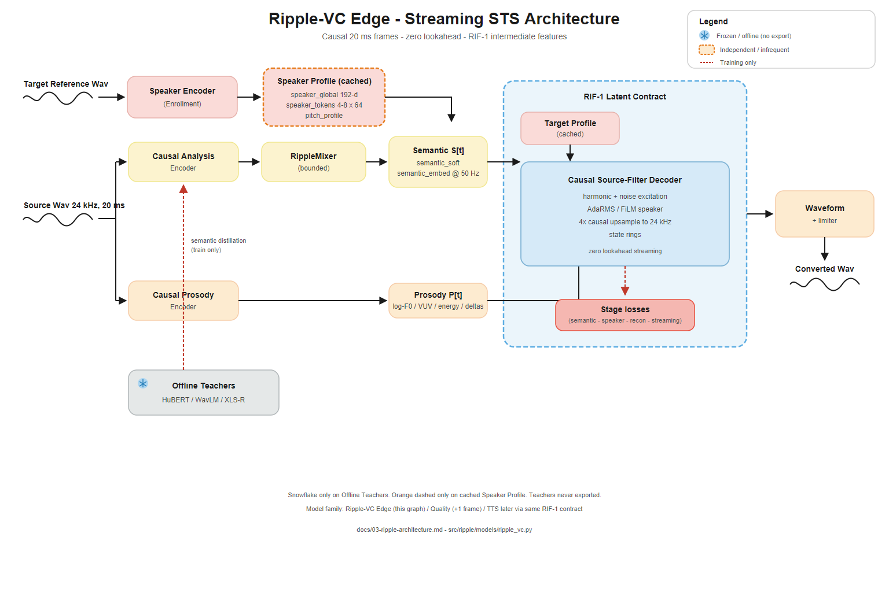

# Ripple - Streaming Speech-to-Speech Voice Conversion

[](https://github.com/rizmyabdulla/Ripple/actions/workflows/cpu-ci.yml)
[](LICENSE)

Ripple is a **streaming speech-to-speech (STS) voice-conversion** project: change a live
voice into an enrolled target voice in fixed **20 ms** chunks, with bounded state suitable
for long sessions and edge export.

The design keeps a stable **RIF-1** interface (semantic + prosody). Voice conversion feeds
RIF-1 from audio. A later **Ripple-TTS** path can feed the same interface from text without
replacing the decoder. STS training does **not** require TTS.

> **Status (v0.1.0):** software scaffold + synthetic tests. There is not yet a public trained
> checkpoint or measured latency/quality claim. Targets below are design goals until
> reproduced on sealed data and hardware.

Architecture intent and benchmarks live in [`docs/`](docs/README.md). Implementation roadmap:
[`docs/09-implementation-roadmap.md`](docs/09-implementation-roadmap.md).

## Architecture



Causal 20 ms STS: enroll a target once, stream source through analysis / mixer / prosody into the **RIF-1** latent contract, then a causal source-filter decoder. Teachers are train-only and never exported. Full write-up: [`docs/03-ripple-architecture.md`](docs/03-ripple-architecture.md).

## Why Ripple

| Choice | Intent |
|---|---|
| Causal CNN + bounded mixer | Real-time, exportable, no growing KV cache |
| 24 kHz / 20 ms / zero-lookahead default | Edge-friendly streaming cadence |
| Explicit stream state | Deterministic ONNX / native runtime I/O |
| Soft semantic + prosody (RIF-1) | Shared contract for VC now and TTS later |
| Source-filter decoder | Waveform generation with speaker conditioning |
| Local teachers only | No auto-download of HuBERT / WavLM / XLS-R weights |

Ripple is a **new model family**, not a reimplementation of Google StreamVC. A corrected
StreamVC-style baseline (including Yin threshold **0.15**) lives under `src/ripple/baselines`
for comparison.

## Design targets (not yet measured)

- 24 kHz mono; ~25–35M parameters with enrollment encoder
- p95 end-to-end below ~40 ms on a reference mobile CPU (including one frame)
- Sustained RTF &lt; 0.5 on one performance CPU core
- Bounded memory over multi-hour streams
- FP16/BF16 train/reference; INT8 production tier
- Fixed-shape ONNX artifact + optional TensorRT / Core ML / LiteRT / ExecuTorch

See [`docs/README.md`](docs/README.md) for the full acceptance criteria.

## Repository layout

```text
Ripple/
├── src/ripple/
│   ├── contracts/      # RIF-1, speaker profile, stream state, configs, checksums
│   ├── audio/          # Framing, resample, pitch, augmentation, I/O
│   ├── data/           # Manifests, quality filters, feature shards, sampling
│   ├── models/         # Ripple-VC Edge (analysis, mixer, prosody, speaker, decoder)
│   ├── streaming/      # Cached conv, local attention, session / packet-loss policy
│   ├── baselines/      # Corrected StreamVC-compatible baseline
│   ├── teachers/       # Local-only HuBERT / WavLM / XLS-R / Whisper adapters
│   ├── training/       # Losses, stages, Trainer, checkpoints, EMA
│   ├── evaluation/     # WER/CER, speaker, prosody, leakage, long-session
│   ├── benchmark/      # Latency / memory / quality report writers
│   ├── quantization/   # PTQ / QAT / sensitivity helpers
│   ├── export/         # torch.export, ONNX, artifact signing hooks, backends
│   ├── tts/            # Optional text→RIF front-end (Phase 9; skip for STS-only)
│   ├── cli/            # Typer CLI (`ripple`)
│   ├── safety/         # Consent, watermark, provenance helpers
│   └── research/       # Variant registry / matched research gates
├── runtime/            # Native C ABI + CMake tests
├── configs/            # Typed YAML (model, data, train, eval, export, benchmark)
├── tools/              # Thin wrappers around CLI entrypoints
├── fixtures/           # Synthetic multilingual-core manifests (smoke only)
├── tests/              # unit / integration / streaming / export / quant / regression
├── docs/               # Research & architecture dossier
├── governance/         # Dataset / model / safety cards, release checklist
├── adrs/               # Architecture decision records
└── envs/               # Optional per-role environment subprojects
```

## Requirements

- **CPython 3.12** (`>=3.12,<3.13`)
- `libsndfile` (SoundFile I/O)
- A modern NVIDIA GPU for serious training (e.g. RTX 4090 24 GB or rented A100); CPU is fine for contracts, unit tests, and small smoke runs
- Optional: CMake 3.20+ for `runtime/` native tests

## Install

### Windows (PowerShell)

```powershell
py -3.12 -m venv .venv
.\.venv\Scripts\Activate.ps1
python -m pip install --upgrade pip
python -m pip install -e ".[dev,torch,export,data]"
```

### Linux / macOS

```bash
python3.12 -m venv .venv
source .venv/bin/activate
python -m pip install --upgrade pip
python -m pip install -e ".[dev,torch,export,data]"
```

### Optional extras

| Extra | Use |
|---|---|
| `torch` | Models, streaming, training smoke |
| `data` | PyArrow-backed feature / table paths |
| `export` | ONNX + ONNX Runtime conformance |
| `teachers` | `transformers` for local teacher adapters |
| `train` | Torch + data + TensorBoard |
| `eval` | jiwer and related metrics |
| `dev` | pytest, ruff, mypy, hypothesis |
| `all` | Convenience meta-extra |

Training with teachers:

```powershell
python -m pip install -e ".[dev,train,teachers,eval]"
```

Environment sketches also live under `envs/{dev,train,teachers,evaluation,export}`.

## Quick checks

```powershell
python -m ruff check src tests
python -m mypy -p ripple.contracts -p ripple.research
python -m pytest tests -q
ripple --help
```

CI (`.github/workflows/cpu-ci.yml`) runs lint, typed contracts/research, and the CPU test suites.

## Configuration

Resolved configs are immutable Pydantic models loaded from `configs/`:

```powershell
python -c "from pathlib import Path; from ripple.contracts import load_config; print(load_config(Path('configs')).checksum)"
```

| File | Role |
|---|---|
| `configs/model/edge.yaml` | 24 kHz Edge model knobs |
| `configs/data/default.yaml` | Manifest URIs, languages, splits |
| `configs/train/default.yaml` | Stage / batch / LR / precision |
| `configs/eval/default.yaml` | Eval manifests and session length |
| `configs/export/default.yaml` | Backend / opset / streaming verify |
| `configs/benchmark/default.yaml` | Latency / RTF / state budget |

Synthetic smoke data points at `fixtures/multilingual-core/`. Replace with licensed corpora under `/data/` (gitignored) before real training. Planned sources and rights: [`governance/DATASET_CARD_ripple-multilingual-v0.1.0.md`](governance/DATASET_CARD_ripple-multilingual-v0.1.0.md).

## CLI

Entry point: `ripple` (see `src/ripple/cli/`).

```powershell
ripple --help
ripple doctor run
ripple config show
ripple data canonicalize --help
ripple manifest build|seal|validate --help
ripple features extract --help
ripple train stages|run|resume --help
ripple eval run --help
ripple enroll --help
ripple convert --help
ripple stream --help
ripple export --help
ripple benchmark --help
```

| Command | Purpose |
|---|---|
| `doctor` | Check Python/torch/CUDA, config load, write access to data/checkpoints |
| `config` | Show resolved config or print its checksum |
| `data canonicalize` | Resample/mono/PCM16 24 kHz WAV trees with provenance |
| `data summarize` | Hours/speakers/languages from a sealed manifest |
| `manifest build` | Draft checksummed JSONL discovery manifests from WAV trees |
| `manifest seal` | Seal draft JSONL into `DatasetManifest` contracts (speaker-disjoint splits) |
| `manifest validate` | Load sealed manifests; optional audio checksum verify |
| `features extract` | Extract **local-only** teacher features; write `FeatureManifest` |
| `train stages` | List `TrainingStage` loss weights / module gates |
| `train run` / `resume` | Single-process STS stage training over sealed manifests |
| `eval run` | Reconstruction metrics over a checkpoint + sealed test manifest |
| `enroll` | Create a consent-bound speaker profile |
| `convert` / `stream` | File or chunked conversion through an installed backend |
| `export` | Export and checksum a model artifact |
| `benchmark` | Synthetic streaming-step latency smoke on CPU |

Thin scripts under `tools/` call the same CLIs. Training is single-process in v1 (no DDP/`torchrun` yet).

## Suggested STS (voice conversion) workflow

Skip Phase 9 (TTS) if you only want speech→speech.

```text
raw WAVs → ripple data canonicalize → ripple manifest build → seal
  → ripple features extract → ripple train run → ripple eval run → export
```

1. **Env** — install `.[dev,train,teachers,eval]` on a clean 3.12 venv / rented GPU box; run `ripple doctor`.
2. **Data** — start with an English pilot (e.g. LibriTTS), keep originals under `/data/raw/`, canonicalize to `/data/canonical/`.
3. **Manifests** — `ripple manifest build` (JSONL) then `seal` / `validate` with license + consent; speaker-disjoint splits are enforced at seal.
4. **Teachers** — place HuBERT / WavLM / XLS-R weights **locally**; `ripple features extract` (no automatic download).
5. **Train** — e.g. `ripple train run --stage decoder_reconstruction ...` then `semantic_student` (needs features); further stages land as hooks on existing losses.
6. **Eval** — `ripple eval run --checkpoint ... --manifest test.json`; ASR WER needs the `eval` extra.
7. **Export** — fixed-state ONNX + artifact bundle (`export/`, optional `runtime/`).

Rough compute: English pilot listen-able checkpoint often **~2–4 weeks** on one A100/4090 including engineering; full 1000+ h multilingual STS is typically **months** on one GPU unless you multi-GPU.

## Documentation map

| Doc | Contents |
|---|---|
| [`docs/README.md`](docs/README.md) | Executive decision and dossier index |
| [`docs/03-ripple-architecture.md`](docs/03-ripple-architecture.md) | Model design |
| [`docs/04-training-data-and-losses.md`](docs/04-training-data-and-losses.md) | Data + loss recipe |
| [`docs/05-streaming-and-inference.md`](docs/05-streaming-and-inference.md) | Streaming algorithm |
| [`docs/06-deployment-quantization-and-export.md`](docs/06-deployment-quantization-and-export.md) | Deploy / quant / export |
| [`docs/07-evaluation-and-benchmarks.md`](docs/07-evaluation-and-benchmarks.md) | Gates and metrics |
| [`docs/09-implementation-roadmap.md`](docs/09-implementation-roadmap.md) | Phases 0–10 |
| [`docs/10-tts-extension-and-future-research.md`](docs/10-tts-extension-and-future-research.md) | Optional TTS / variants |

## Governance

- Dataset / model / safety card templates and release checklist: [`governance/`](governance/)
- Multilingual v0.1.0 card draft: [`governance/DATASET_CARD_ripple-multilingual-v0.1.0.md`](governance/DATASET_CARD_ripple-multilingual-v0.1.0.md)
- ADRs: [`adrs/`](adrs/)

No training sample should enter a sealed manifest without provenance and license fields. No public model release without Legal review of data + weight licensing.

## Development notes

- Prefer **TorchCodec** for decode when available; SoundFile is the fallback. Avoid depending on TorchAudio in new code.
- Imports: `ripple` is first-party for Ruff (`known-first-party` in `pyproject.toml`).
- Root `/data/` is gitignored for raw corpora; package code lives in `src/ripple/data/` (tracked).
- Research variants must use matched gates via `ripple.research` — do not promote experiments into Edge without ADR + eval.

## Licensing

This project is licensed under [Creative Commons Attribution 4.0 International (CC BY 4.0)](https://creativecommons.org/licenses/by/4.0/). See [`LICENSE`](LICENSE) for the full text.

**Dataset corpora and trained model weights are licensed separately** and must be tracked in dataset/model cards and manifests. Shipping a checkpoint inherits every upstream data/teacher license constraint.

## Citation

If you use Ripple in research, please cite this repository and the architecture dossier under `docs/`, and attribute per CC BY 4.0. Fill in a formal BibTeX entry when you publish a paper or technical report.
